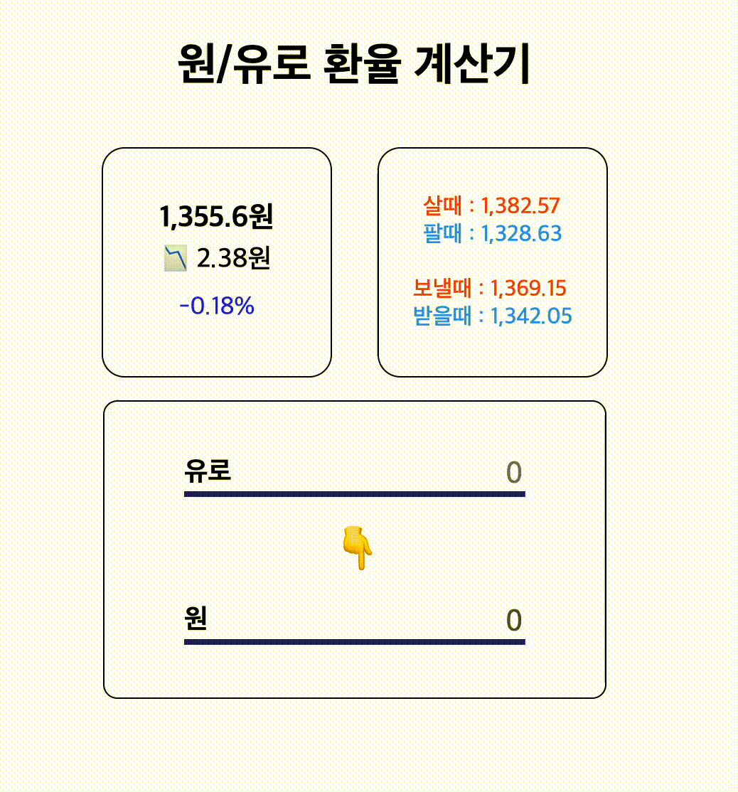

# 유로-원 환율 계산기

- 컴포넌트는 주제가 같은 단위로 구분해 작성하였고 추후 재사용할 것 같은 컴포넌트를 public으로 별도 분리했습니다.
- API key의 경우 이번에는 공개 API 및 별도 private key가 없으나, 추후 추가되는 api가 private해야할 필요가 있을 수 있으므로 api폴더로 분리하였습니다.
- 타입 폴더와 타입 파일을 따로 작성해 유지보수 용이하도록 하였습니다.
- API를 불러들이는 과정은 별도 custom hook으로 제작해 추후 다른 data를 불러들여야할 필요가 있을 때 쉽게 사용할 수 있도록 하였습니다.
- 환율은 장 시간 중 계속 업데이트가 되므로 5초마다 한번씩 API를 불러들이도록 했습니다.
- 마찬가지로 value를 받아 특정 화폐로 환전하는 exchange 함수도 custom 훅으로 제작해 추후 재사용 가능하도록 하였습니다.
